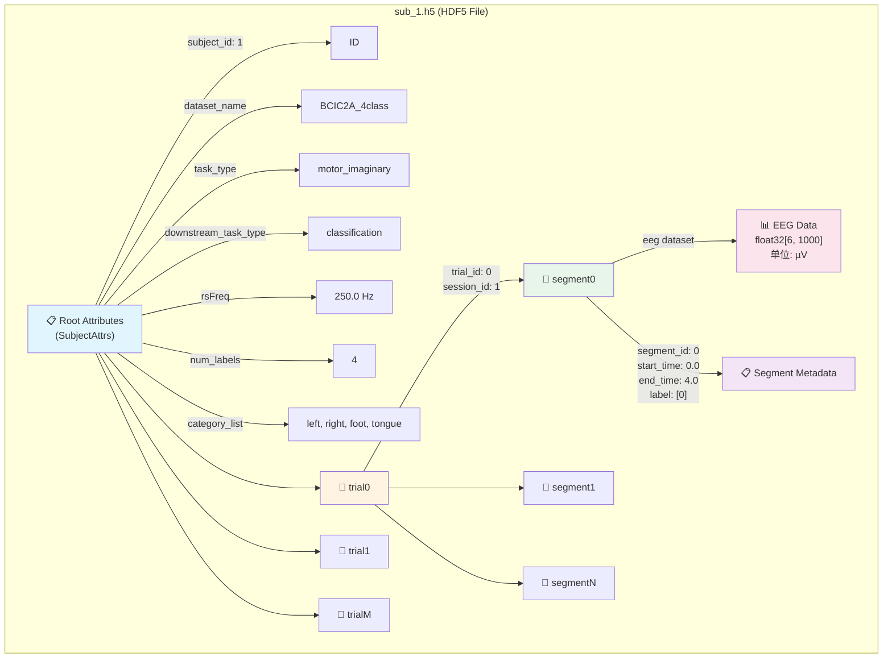
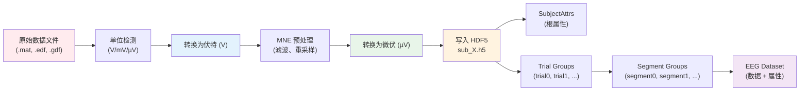
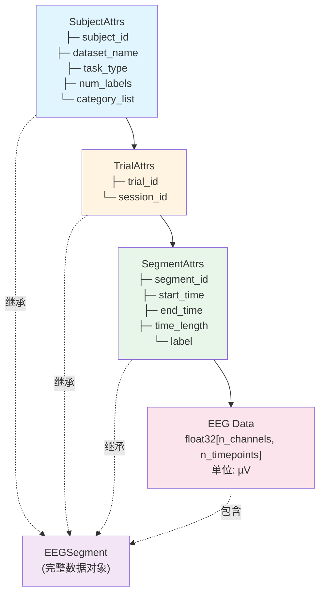
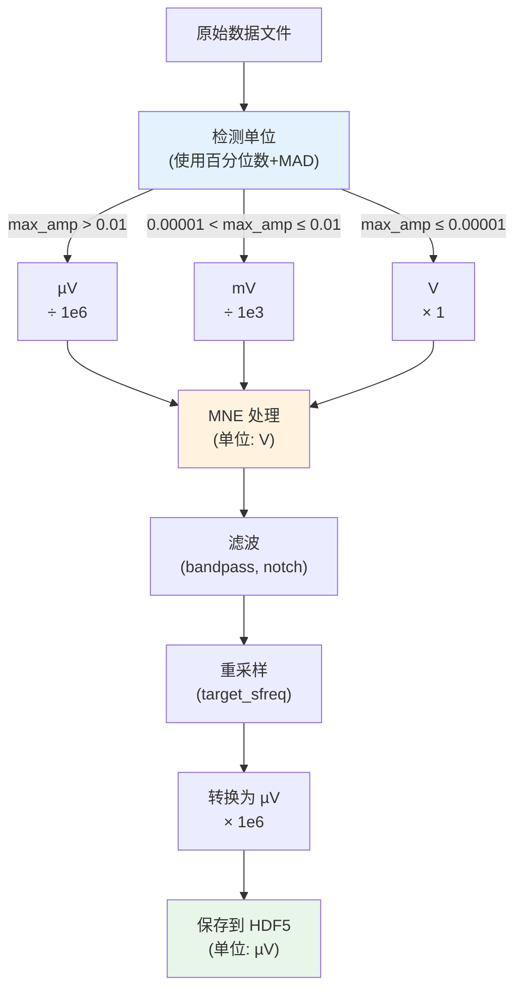

# HDF5 数据结构可视化图表

## 1. 层次结构树状图

```
sub_1.h5 (HDF5 File)
│
├─ 📋 Root Attributes (SubjectAttrs)
│  │
│  ├─ subject_id: 1
│  ├─ dataset_name: "BCIC2A_4class"
│  ├─ task_type: "motor_imaginary"
│  ├─ downstream_task_type: "classification"
│  ├─ rsFreq: 250.0
│  ├─ chn_name: ["FZ", "FC3", "C3", "CZ", "C4", "FC4"]
│  ├─ num_labels: 4
│  ├─ category_list: ["left", "right", "foot", "tongue"]
│  ├─ chn_pos: None
│  ├─ chn_ori: None
│  ├─ chn_type: "EEG"
│  └─ montage: "10_20"
│
├─ 📁 trial0 (Group)
│  │
│  ├─ 📋 Attributes (TrialAttrs)
│  │  ├─ trial_id: 0
│  │  └─ session_id: 1
│  │
│  ├─ 📁 segment0 (Group)
│  │  └─ 📊 eeg (Dataset: float32[6, 1000])
│  │     ├─ 📋 Attributes (SegmentAttrs)
│  │     │  ├─ segment_id: 0
│  │     │  ├─ start_time: 0.0
│  │     │  ├─ end_time: 4.0
│  │     │  ├─ time_length: 4.0
│  │     │  └─ label: [0]
│  │     └─ 📈 Data: EEG signal (µV)
│  │
│  ├─ 📁 segment1 (Group)
│  │  └─ 📊 eeg (Dataset: float32[6, 1000])
│  │     └─ ...
│  │
│  └─ 📁 segmentN (Group)
│     └─ ...
│
├─ 📁 trial1 (Group)
│  └─ ...
│
└─ 📁 trialM (Group)
   └─ ...
```

---

## 2. Mermaid 图表



---

## 3. 数据流图



---

## 4. 属性继承关系



---

## 5. 字段类型和约束表

### SubjectAttrs (根属性)

| 字段 | 类型 | 必需 | 默认值 | 约束 | 示例 |
|------|------|------|--------|------|------|
| `subject_id` | int \| str | ✅ | - | 唯一标识符 | `1`, `"sub_001"` |
| `dataset_name` | str | ✅ | - | 非空字符串 | `"BCIC2A_4class"` |
| `task_type` | str | ✅ | - | 枚举值 | `"motor_imaginary"` |
| `downstream_task_type` | str | ✅ | - | 枚举值 | `"classification"` |
| `rsFreq` | float | ✅ | - | > 0 | `250.0` |
| `chn_name` | list[str] | ✅ | - | 非空列表 | `["FZ", "FC3"]` |
| `num_labels` | int | ⚠️ | `0` | ≥ 0 | `4` |
| `category_list` | list[str] | ⚠️ | `[]` | len = num_labels | `["left", "right"]` |
| `chn_pos` | np.ndarray \| None | ⚠️ | `None` | shape: (n, 3) | `None` |
| `chn_ori` | np.ndarray \| None | ⚠️ | `None` | shape: (n, 3) | `None` |
| `chn_type` | str | ✅ | - | 非空字符串 | `"EEG"` |
| `montage` | str | ✅ | - | 非空字符串 | `"10_20"` |

### TrialAttrs (Trial 组属性)

| 字段 | 类型 | 必需 | 约束 | 示例 |
|------|------|------|------|------|
| `trial_id` | int | ✅ | ≥ 0, 唯一 | `0`, `1`, `2` |
| `session_id` | int | ✅ | ≥ 0 | `1`, `2` |

### SegmentAttrs (Segment 组属性)

| 字段 | 类型 | 必需 | 约束 | 示例 |
|------|------|------|------|------|
| `segment_id` | int | ✅ | ≥ 0, 在 trial 内唯一 | `0`, `1`, `2` |
| `start_time` | float | ✅ | ≥ 0 | `0.0`, `4.0` |
| `end_time` | float | ✅ | > start_time | `4.0`, `8.0` |
| `time_length` | float | ✅ | = end_time - start_time | `4.0` |
| `label` | np.ndarray | ✅ | 形状可变 | `[0]`, `[1, 0, 0]` |

### EEG Dataset

| 属性 | 类型 | 约束 | 示例 |
|------|------|------|------|
| 数据类型 | `float32` | - | - |
| 形状 | `[n_channels, n_timepoints]` | n_channels > 0, n_timepoints > 0 | `[6, 1000]` |
| 单位 | µV (微伏) | - | - |
| 命名 | `eeg` | - | - |

---

## 6. 访问路径示例

### Python 访问路径

```python
# 文件级别
file = h5py.File("sub_1.h5", "r")

# Subject 属性
subject_id = file.attrs["subject_id"]
num_labels = file.attrs["num_labels"]
category_list = file.attrs["category_list"]

# Trial 组
trial0 = file["trial0"]
trial_id = trial0.attrs["trial_id"]
session_id = trial0.attrs["session_id"]

# Segment 组
segment0 = trial0["segment0"]
segment_id = segment0["eeg"].attrs["segment_id"]
start_time = segment0["eeg"].attrs["start_time"]
end_time = segment0["eeg"].attrs["end_time"]
label = segment0["eeg"].attrs["label"]

# EEG 数据
eeg_data = segment0["eeg"][:]  # shape: [n_channels, n_timepoints]
```

### 路径字符串

```
sub_1.h5
├─ /attrs["subject_id"]
├─ /attrs["num_labels"]
├─ /attrs["category_list"]
├─ /trial0/attrs["trial_id"]
├─ /trial0/attrs["session_id"]
├─ /trial0/segment0/eeg (dataset)
│  ├─ /trial0/segment0/eeg/attrs["segment_id"]
│  ├─ /trial0/segment0/eeg/attrs["start_time"]
│  ├─ /trial0/segment0/eeg/attrs["end_time"]
│  ├─ /trial0/segment0/eeg/attrs["label"]
│  └─ /trial0/segment0/eeg[:] (data array)
└─ /trial0/segment1/eeg ...
```

---

## 7. 数据单位转换流程图



---

## 8. 标签映射示例

### BCIC-2A 数据集示例

```python
# SubjectAttrs 中定义
num_labels = 4
category_list = ["left", "right", "foot", "tongue"]

# Segment 中的标签
label = np.array([0])  # → "left"
label = np.array([1])  # → "right"
label = np.array([2])  # → "foot"
label = np.array([3])  # → "tongue"
```

### 标签索引映射

```
category_list[0] = "left"   ← label = 0
category_list[1] = "right"  ← label = 1
category_list[2] = "foot"   ← label = 2
category_list[3] = "tongue" ← label = 3
```

---

## 总结

- ✅ **层次结构**: Subject → Trial → Segment → EEG Data
- ✅ **元数据完整**: 每个层级都有相应的属性
- ✅ **单位统一**: 所有数据统一为 µV
- ✅ **标签支持**: 支持 `num_labels` 和 `category_list`
- ✅ **时间信息**: Segment 包含完整的时间信息
- ✅ **类型安全**: 使用 dataclass 确保类型一致性

